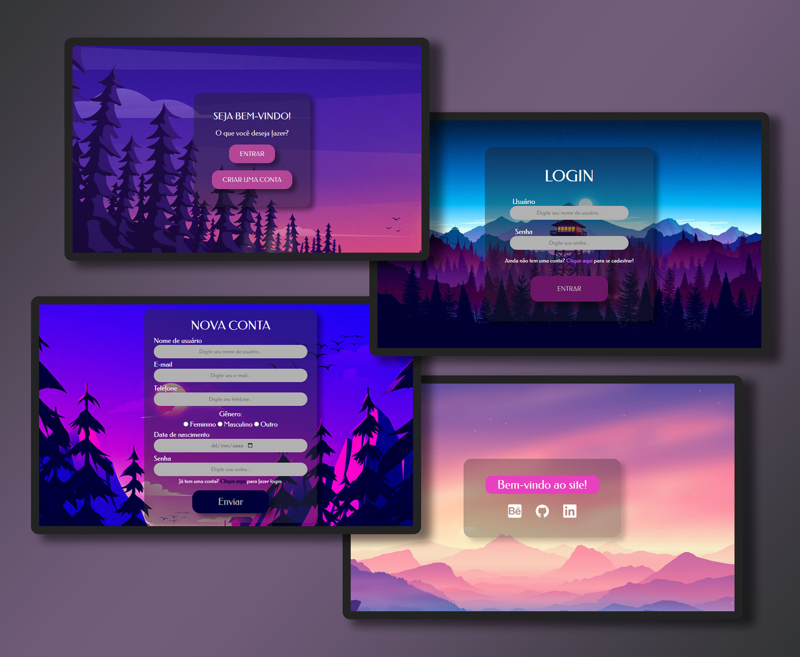

# form-and-login

<h1 align="center"> Formulário e Login | Front-end </h1>

Landing pages para sistema de formulário e login em banco de dados.

 

  

## 🚀 Tecnologias

Esse projeto foi desenvolvido com as seguintes tecnologias:

- HTML e CSS
- Git e Github
- Figma e Photoshop

## ☝️ Desenvolvimento

Como projeto em versionamento 1.0, sua base de front-end foi desenvolvida via Figma, eis que o design e planejamento foram inteiramente autorais. Utilizando tags e estilos adequados no HTML e CSS, com responsividade e atenção à autoria de imagens, o site, que possui suporte a banco de dados, traz uma interface leve e amigável, sendo objeto de estudo das tecnologias front-end e web design.